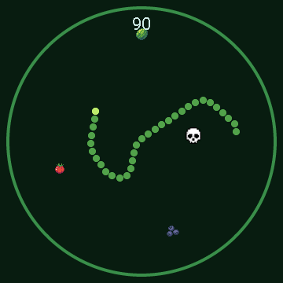

# ESPHome Voice Assistant for the Guition JC3636K718C (round knob display)

A full-featured **Home Assistant Voice Assistant** running on the **Guition
JC3636K718C** - a 1.8" round 360×360 touch display with a rotary knob, speaker,
microphone and an **addressable LED ring**. It's pure ESPHome (no custom C firmware):
an always-on core plus optional screen packages you pick from one thin config.

It started as "my kid needs a physical timer" and turned into a whole puck. 🙂

## Demo

<div align="center">
  <video src="https://github.com/user-attachments/assets/e945f4ec-b80f-4740-9130-ed93bd2ab31b" controls width="400"></video>
</div>

## What it does

- **Voice assistant** - on-device wake word ("Alexa") via `micro_wake_word`, full
  Home Assistant Assist pipeline (STT / LLM / TTS), wake beep + music ducking. You can also
  press and hold the screen to talk (toggleable in Settings).
- **Boot splash** - a short "HELLO!" greeting with a spinning ring on startup, then the clock.
- **Music player** - `speaker` media player visible in HA / Music Assistant, with
  album art, title/artist, transport buttons and a progress bar.
- **Timers** - set by knob or by voice; big countdown with a depleting ring,
  pause/stop, and an alarm (sound + on-screen + LED) when it finishes.
- **Device control** - a tiles screen toggling your lights/switches.
- **Home screen** - clock, date, battery, weather + room temp/humidity, with a **selectable watchface** look (Classic, Neon, or your own).
- **More screens** (all optional, knob-driven) - a weather forecast dial, a thermostat for
  any `climate` entity, and a configurable multi-sensor glance.
- **LED ring** - controllable from HA *and* reactive: assistant (comet/spinner/wave),
  timer countdown, alarm flash, volume bar - each reaction toggleable in Settings.
- **Four built-in arcade games** (a lane racer, a vertical shooter, a 360-degree snake and a Gyruss-style tube shooter) for the kid.

Everything is navigated with **swipes + taps on the screen** and the **rotary knob**.

## Screens

| Screen | View |
|:---:|---|
|  | **Home / Clock**<br>Time, date, battery (a bolt while charging), outdoor weather and room temperature + humidity. Pick the watchface look in Settings → Home - see [Watchfaces](#watchfaces) below. |
|  | **Player**<br>Album art, title & artist, prev / play-pause / next and a progress bar. Auto-shows when playback starts. |
|  | **Control tiles** (swipe up)<br>Four configurable tiles toggling any HA entity; each has its own icon and label, and the colour follows the live on/off state. |
|  | **Weather**<br>A 7-day dial; turn the knob to scroll days. Animated condition icon, colour-coded temperature, and a glow that slides to the selected day. |
|  | **Thermostat**<br>A dial for a `climate.*` entity; the knob sets the target (a head-dot rides the gauge), tap toggles on/off. The whole arc is colour-coded by action - heating / cooling / idle / off. |
|  | **Sensors**<br>A glance of 1-6 configurable Home Assistant entities, shown big one at a time; turn the knob to cycle (dots show the position). Each gets its own accent colour. Any entity, pulled straight from HA. |
|  | **Timer**<br>Set by knob or voice; big countdown with a colour-coded depleting ring (green → amber → red) and a head-dot, SET / RUNNING / PAUSED status, pause/stop, and a fancy alarm screen when it finishes. |
|  | **Cool Cars**<br>A lane-racing arcade game - the knob steers, dodge traffic and grab coins. |
|  | **Space Wars**<br>A vertical space shooter - the knob steers, auto-fire, survive the waves. |
|  | **Snake 360**<br>A smooth-steering 360-degree snake - turn the knob to steer the head and the body trails behind, across the whole round screen. |
|  | **Knobuss**<br>A **Gyruss clone**: your ship orbits the rim and auto-fires inward while foes spiral out of a black-hole core - turn the knob to aim and shoot them down. **Every foe that reaches the rim costs a life** (it bursts in an explosion). 3 lives, top-10 scores. |
|  | **Settings** (swipe down)<br>Display, Home screen, Widgets, LED Ring, Voice Assistant, System; turn the knob to scroll, tap to enter. |
|  | **Demo**<br>A small, heavily commented example screen (tap flips black ↔ white) to copy when building your own. |

> Optional screens (player, timer, games, weather, thermostat, sensors, demo) are pickable - choose which compile in and their order; see [Configuration](https://github.com/MichalZaniewicz/esphome-guition-jc3636k718c-va/wiki/Configuration).

## Watchfaces

The home screen has a **selectable look**. Open **Settings → Home → Watchface** and the knob previews each face live, full-screen - tap to keep. **Classic** is built in; **Neon** (big neon digits), **Minecraft** (a blocky day/night scene) and a heavily-commented **Demo** template are optional files you switch on in your config, and you can copy Demo to build your own (see [Configuration](https://github.com/MichalZaniewicz/esphome-guition-jc3636k718c-va/wiki/Configuration)).

| Classic (built-in) | Neon | Minecraft | Demo (template) |
|:---:|:---:|:---:|:---:|
|  |  |  |  |

## Documentation

Full docs live in the **[wiki](https://github.com/MichalZaniewicz/esphome-guition-jc3636k718c-va/wiki)**:

| Page | What's inside |
|---|---|
| [Hardware](https://github.com/MichalZaniewicz/esphome-guition-jc3636k718c-va/wiki/Hardware) | Board specs, full pinout, what to buy on AliExpress |
| [Installation](https://github.com/MichalZaniewicz/esphome-guition-jc3636k718c-va/wiki/Installation) | Requirements, first flash (USB), OTA, the bundled sounds |
| [Usage](https://github.com/MichalZaniewicz/esphome-guition-jc3636k718c-va/wiki/Usage) | Gestures, screens, the settings menu, the LED ring |
| [Configuration](https://github.com/MichalZaniewicz/esphome-guition-jc3636k718c-va/wiki/Configuration) | Change entities, tiles, wake word, run without Music Assistant |
| [Troubleshooting](https://github.com/MichalZaniewicz/esphome-guition-jc3636k718c-va/wiki/Troubleshooting) | Known issues (battery %, GPIO0 strapping, performance, the knob) |

Release history: [CHANGELOG.md](CHANGELOG.md).

## Quick start

1. Copy `secrets.example.yaml` → `secrets.yaml` and fill in your Wi-Fi.
2. Copy **`guition-va.yaml`** and **`partitions.csv`** so they sit together with `secrets.yaml`. Edit the `substitutions:` at the top of `guition-va.yaml` (HA URL + your entity IDs + the four control tiles). That thin file is the only firmware file you keep - the core and all screens are **pulled from GitHub at compile time** (see its `packages:` block), as are the fonts, images and sounds.
3. Choose which screens compile in via the `files:` list and their left-to-right order via `screen_order`, both in `guition-va.yaml`.
4. **First flash over USB** - easiest via the **ESPHome dashboard** (GUI) or the CLI; the 16 MB partition table can't be set over OTA, so the first flash is USB, then updates go wireless.
5. In Home Assistant: open the new ESPHome device → assign an Assist pipeline.

To pull the latest changes later: `esphome clean guition-va.yaml` (clears the package cache) then `esphome run guition-va.yaml`.

Full details on the [Installation](https://github.com/MichalZaniewicz/esphome-guition-jc3636k718c-va/wiki/Installation) wiki page.

## Repository layout

```
guition-va.yaml            # YOUR config: copy + edit this (pulls everything else from GitHub)
partitions.csv             # 16 MB partition table (keep next to guition-va.yaml)
secrets.example.yaml       # copy to secrets.yaml
base/                      # pulled as a remote package at compile time (no need to copy)
  core.yaml                # always-on core: clock, controls (swipe-up tiles), settings menu
  screens/                 # optional carousel screens (toggle each in guition-va.yaml)
    player.yaml            #   music player (album art + transport)
    timer.yaml             #   timer screen in the carousel
    cool-cars.yaml         #   "Cool Cars" game
    space-wars.yaml        #   "Space Wars" game
    snake.yaml             #   "Snake 360" game (knob steers)
    knobuss.yaml           #   "Knobuss" game (Gyruss-style tube shooter, knob aims)
    weather.yaml           #   weather (today + 7-day radial dial)
    thermostat.yaml        #   thermostat (climate.* dial; knob sets target, tap on/off)
    sensors.yaml           #   sensors glance (1-6 HA entities, knob cycles)
    demo.yaml              #   commented example screen
    weather.ha-helper.yaml #   HA template sensor that feeds the weather screen
  watchfaces/              # optional home-screen looks (Classic is built into core)
    neon.yaml              #   "Neon" watchface - big two-tone digits + neon rings
    minecraft.yaml         #   "Minecraft" watchface - blocky day/night scene + pixel clock
    demo.yaml              #   "Demo" watchface - minimal, heavily-commented template to copy
assets/                    # fetched from GitHub at compile time (no need to copy locally)
  header.jpg               # banner
  fonts/pixel-font.ttf     # pixel font (Minecraft watchface)
  sounds/                  # wake.wav + alarm.wav
  sprites/cool-cars/       # "Cool Cars" game graphics
  sprites/space-wars/      # "Space Wars" game graphics
  sprites/snake/           # "Snake" menu logo
  sprites/knobuss/         # "Knobuss" game graphics (ship/foes/explosion/core/logo)
  sprites/minecraft/       # "Minecraft" watchface graphics (sun/moon/ground/flower)
  sprites/weather/         # animated weather icon frames
scripts/
  make_sounds.py           # (re)generate the wav sounds
  gen_weather.py           # (re)generate the animated weather icon frames
  gen_snake.py             # (re)generate the snake sprites
  esplog.py                # stream device logs over the native API
skill/                     # Claude Code skill: hardware spec + gotchas
```

## Claude Code skill

This repo ships a [Claude Code](https://claude.com/claude-code) skill at
[`skill/guition-jc3636k718c/`](skill/guition-jc3636k718c/SKILL.md). It gives the
assistant the correct pinout, ESPHome component choices, and the hard-won gotchas
(the knob isn't quadrature, GPIO0 ring strapping, 16 MB partitions need a USB flash,
LVGL performance limits, lambda/string pitfalls, the battery heuristic).

### Install it

So Claude can use it on any project:

- **User-wide** - copy the folder into `~/.claude/skills/`:
  ```bash
  cp -r skill/guition-jc3636k718c ~/.claude/skills/
  ```
- **Per-project** - copy it into that project's `.claude/skills/`.

Start a new Claude Code session and ask anything about this board; the skill loads
automatically. See the [wiki](https://github.com/MichalZaniewicz/esphome-guition-jc3636k718c-va/wiki/Claude-Code-Skill) for details.

## Credits / notes

- Pinout and the display `init_sequence` come from the **official manufacturer demo**
  (`JC3636K718_knob_EN`) - this is the correct pinout for the **K718C** board, which
  differs from the otherwise-similar **JC3636W518**.
- Built with [ESPHome](https://esphome.io/) + Home Assistant.
